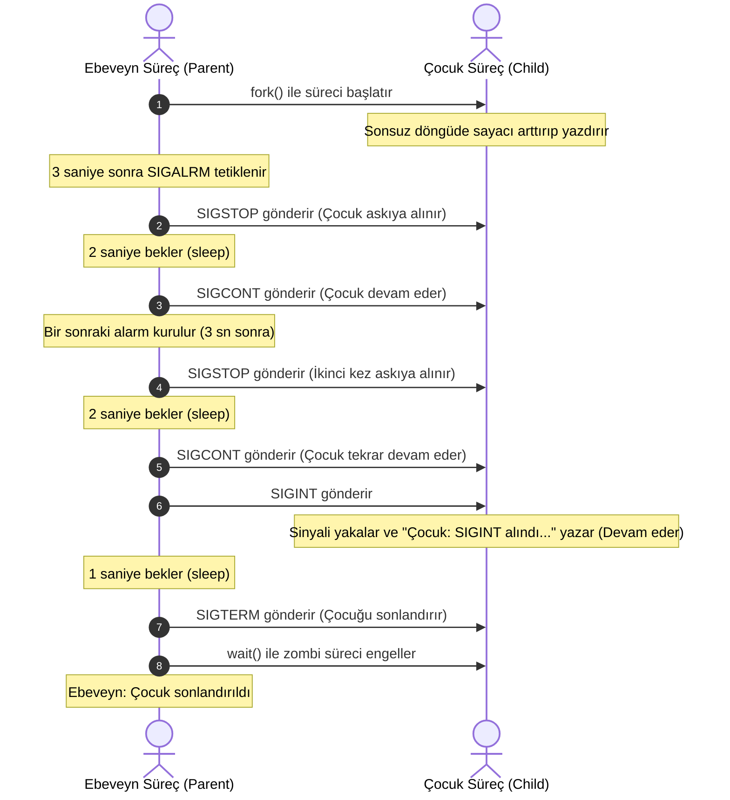

# Sistem Programlama - Kısa Sınav Ödevi

Bu proje, **Sistem Programlama** dersi kısa sınav ödevi kapsamında C programlama dili ile geliştirilmiş iki ayrı uygulamayı içermektedir.

Uygulamalar; dinamik bellek yönetimi, pointer aritmetiği ve Linux/Unix ortamında süreç kontrolü ile sinyal işleme mekanizmalarını pratik etmek amacıyla tasarlanmıştır.

---

## 📂 Proje İçeriği ve Yapısı

Proje dizinindeki temel dosyalar aşağıda açıklanmıştır:

| Dosya Adı | Açıklama |
| :--- | :--- |
| **[soru1_special_sum.c](file:///c:/Users/Emirhan/Desktop/Bilgisayar%20m%C3%BChendisli%C4%9Fi%203.s%C4%B1n%C4%B1f%202.%20d%C3%B6nem/sistem_prog/k%C4%B1sas%C4%B1nav/k%C4%B1sas%C4%B1nav/soru1_special_sum.c)** | Tek boyutlu bellek bloğunda $N \times N$ matris işlemlerini gerçekleştiren program. |
| **[soru2_signal_handling.c](file:///c:/Users/Emirhan/Desktop/Bilgisayar%20m%C3%BChendisli%C4%9Fi%203.s%C4%B1n%C4%B1f%202.%20d%C3%B6nem/sistem_prog/k%C4%B1sas%C4%B1nav/k%C4%B1sas%C4%B1nav/soru2_signal_handling.c)** | `fork()`, `signal()`, `alarm()`, ve `kill()` sistem çağrılarıyla süreçler arası sinyal yönetimini simüle eden program. |
| **[projeraporu.pdf](file:///c:/Users/Emirhan/Desktop/Bilgisayar%20m%C3%BChendisli%C4%9Fi%203.s%C4%B1n%C4%B1f%202.%20d%C3%B6nem/sistem_prog/k%C4%B1sas%C4%B1nav/k%C4%B1sas%C4%B1nav/projeraporu.pdf)** | Proje geliştirme ve analiz raporu. |
| **[Benioku.txt](file:///c:/Users/Emirhan/Desktop/Bilgisayar%20m%C3%BChendisli%C4%9Fi%203.s%C4%B1n%C4%B1f%202.%20d%C3%B6nem/sistem_prog/k%C4%B1sas%C4%B1nav/k%C4%B1sas%C4%B1nav/Benioku.txt)** | Projenin düz metin formatındaki orijinal açıklama dosyası. |

---

## 🛠️ Derleme ve Çalıştırma

Tüm programlar standart C kütüphaneleri kullanılarak yazılmıştır ve GCC derleyicisi ile derlenebilir.

### Soru 1: Matris Diyagonal Toplamı
```bash
gcc soru1_special_sum.c -o soru1
./soru1
```

### Soru 2: Sinyal Yönetimi (Linux/Unix)
> [!WARNING]
> Soru 2, Unix tabanlı sistem çağrılarını (`fork`, `signal`, `alarm`, `kill`) kullandığı için **Linux, macOS** veya **WSL (Windows Subsystem for Linux)** ortamlarında derlenip çalıştırılmalıdır.

```bash
gcc soru2_signal_handling.c -o soru2
./soru2
```

---

## 💎 Program Detayları

### 1️⃣ Soru 1: Dinamik Matris ve Özel Toplam (`soru1_special_sum.c`)

Bu program, kullanıcının girdiği boyutta ($N \times N$) dinamik bir kare matris oluşturur ve matrisin **ana diyagonal** ile **yan diyagonal** üzerindeki elemanların toplamını tek bir döngü/mantık altında hesaplar.

> [!NOTE]
> **Önemli Tasarım Kararları ve Kurallar:**
> - **Dinamik Bellek:** Matris, `malloc` ile tek boyutlu bir bellek bloğu olarak tahsis edilir (`n * n * sizeof(int)`).
> - **Pointer Aritmetiği:** Matris elemanlarına erişmek için `mat[i][j]` sözdizimi **kullanılmamış**, sadece pointer aritmetiği tercih edilmiştir: `*(mat + i * cols + j)`.
> - **Çift Sayma Engeli (Merkez Eleman):** Boyutu tek sayı olan matrislerde merkez elemanın hem ana hem de yan diyagonalde yer almasından dolayı iki kez toplanması, mantıksal `||` (veya) operatörü kullanılarak engellenmiştir.
> - **Bellek Yönetimi:** Program başarıyla sonlanmadan önce tahsis edilen bellek alanı `free(mat)` ile sisteme iade edilir.

#### Örnek Çalışma Çıktısı:
```text
Matris boyutunu giriniz (N): 3
3 x 3 matris elemanlarini giriniz:
Eleman [0][0]: 1
Eleman [0][1]: 2
Eleman [0][2]: 3
Eleman [1][0]: 4
Eleman [1][1]: 5
Eleman [1][2]: 6
Eleman [2][0]: 7
Eleman [2][1]: 8
Eleman [2][2]: 9
Ana diyagonal ve yan diyagonal toplami: 25
```
*(Hesaplama: Ana diyagonal [1, 5, 9] + Yan diyagonal [3, 7] (5 zaten sayıldı) = 1 + 5 + 9 + 3 + 7 = 25)*

---

### 2️⃣ Soru 2: Süreç Yönetimi ve Sinyal İşleme (`soru2_signal_handling.c`)

Bu program, çoklu süreç (multiprocessing) yönetimini ve süreçlerin birbirlerine sinyaller vasıtasıyla nasıl müdahale edebileceğini göstermek amacıyla yazılmıştır.

#### Süreç ve Sinyal Akış Şeması
Aşağıdaki diyagram, Ebeveyn (Parent) ve Çocuk (Child) süreçler arasındaki zamanlama ve sinyal ilişkisini göstermektedir:



> [!IMPORTANT]
> **Kullanılan Sinyaller ve Sistem Çağrıları:**
> - `fork()`: Ebeveyn sürecin çocuk süreci oluşturmasını sağlar.
> - `SIGALRM` & `alarm()`: Ebeveyn sürecin belirli zaman aralıklarıyla eyleme geçmesi için zamanlayıcı kurar.
> - `SIGSTOP`: Çocuk süreci geçici olarak askıya alır (bu sinyal yakalanamaz/bloklanamaz).
> - `SIGCONT`: Askıya alınmış olan çocuk sürecin kaldığı yerden devam etmesini sağlar (özel handler ile sinyal yakalanıp "İşlem yeniden başlatıldı" mesajı basılır).
> - `SIGINT`: Çocuk sürece kesme sinyali gönderilir. Normalde sonlandırma yapan bu sinyal, çocuk sürecin `signal(SIGINT, handle_sigint)` kaydı sayesinde yakalanır ve sürecin sonlanması engellenip sadece ekrana bilgi mesajı yazdırılması sağlanır.
> - `SIGTERM`: Ebeveyn süreç işini bitirdiğinde çocuk süreci sonlandırmak amacıyla bu sinyali gönderir.
> - `wait()`: Sonlanan çocuk sürecin arkasında zombi süreç bırakmaması için ebeveyn tarafından beklenmesini sağlar.

#### Örnek Terminal Çıktısı:
```text
Çocuk sayacı: 0
Çocuk sayacı: 1
Çocuk sayacı: 2
Ebeveyn: Çocuk durduruluyor...
Ebeveyn: Çocuk devam ediyor...
Çocuk: İşlem yeniden başlatıldı
Çocuk sayacı: 3
Çocuk sayacı: 4
Çocuk sayacı: 5
Ebeveyn: Çocuk durduruluyor...
Ebeveyn: Çocuk devam ediyor...
Ebeveyn: SIGINT gönderiliyor...
Çocuk: İşlem yeniden başlatıldı
Çocuk: SIGINT alındı ancak devam ediliyor...
Çocuk sayacı: 6
Ebeveyn: Çocuk sonlandırıldı.
```

---

## 📝 Lisans ve Akademik Dürüstlük

Bu proje akademik bir ödev kapsamında hazırlanmıştır. Eğitim ve araştırma amaçlı kullanılabilir, incelenebilir.
